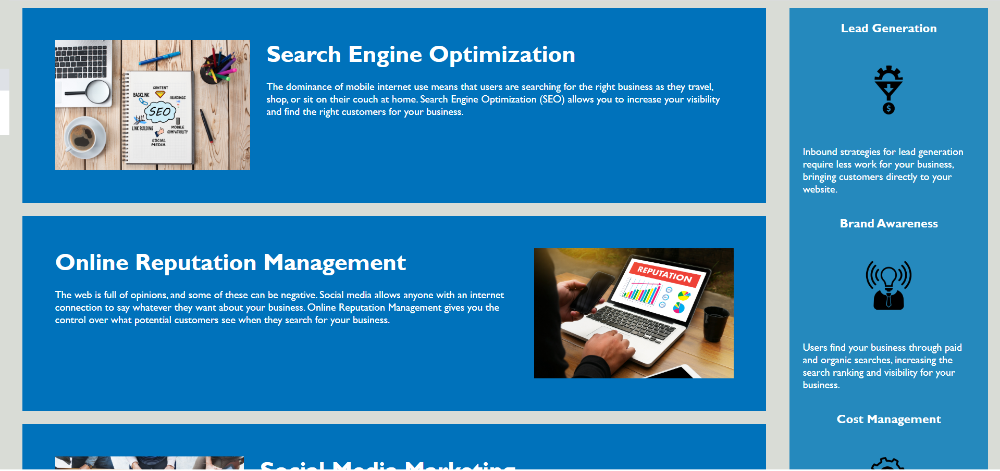

# Code Refactor: Horiseon Social Solution Services

The objective of this exercise was to take existing code and to refactor it to meet the below client objectives:
* codebase follows accessibility standards
* site is optimized for search engines

The client also provided a list of criteria for acceptance of the refactored codebase:

```
GIVEN a webpage meets accessibility standards
WHEN I view the source code
THEN I find semantic HTML elements
WHEN I view the structure of the HTML elements
THEN I find that the elements follow a logical structure independent of styling and positioning
WHEN I view the image elements
THEN I find accessible alt attributes
WHEN I view the heading attributes
THEN they fall in sequential order
WHEN I view the title element
THEN I find a concise, descriptive title
```
## Site Picture


## Approach

For the express purposes of this exercise, adjustments were made to remain within the scope of the aforementioned objectives and acceptance criteria. The code will likely require additional refactoring to ensure consistency across different platforms / browser sizes and thus, detailed comments have been added throughout.

The code was first checked for functionality, then clarity, and finally accessibility.

From a functionality perspective, the main item to note was a "broken" navigation button which was pointing to a missing id and repaired as follows:

```
<!-- entered missing id tag to fix nav link -->
<section id="search-engine-optimization" class="search-engine-optimization">
```
From a clarity perspective, where possible, non-semantic html (e.g."div") was replaced with semantic html.  This was done to help provide clarity for both future coders and for SEO purposes.  Below are a few samples:

```
<!-- changed from "div" to "section"-->
<section id="online-reputation-management" class="online-reputation-management">

<!-- changed from "div" to "aside" -->
<aside class="benefits">
```
Additional clarity was addressed through and adjustment made to the title.

From an accessibility perspective, alt text was added for each image. Additionally, the most difficult aspect in terms of accessibility was the usage of a background image as the main image for the site. As background images do not permit for alt text to be entered, they are effectively invisible to impaired visitors.  To address this issue, the image was moved into the html file while utilizing the following code to address image cropping:

HTML:
```
    <!-- introduced "div" to encompass header and image -->
    <div class="wrapper">
        <!-- changed from "div" to "header" -->
        <header class="header">
            <h1>Hori<span class="seo">seo</span>n</h1>
            <div>
                <ul>
                    <li>
                        <a href="#search-engine-optimization">Search Engine Optimization</a>
                    </li>
                    <li>
                        <a href="#online-reputation-management">Online Reputation Management</a>
                    </li>
                    <li>
                        <a href="#social-media-marketing">Social Media Marketing</a>
                    </li>
                </ul>
            </div>
        </header>
        <!-- introduced image to replace background image and add "alt" for accessibility -->
        
    </div>
```
CSS:
```
/* replaced ".hero" to create a container for the image */
.wrapper {
    height: 910px;
    width: 100%;
    overflow: hidden;
    position: relative;
    margin-bottom: 25px;
}

/* replaced ".hero" to adjust image attributes */
.marketing {
    width: 100%;
    z-index: -1;
    position: absolute;
    top: 0;
}
```

## Built With

* [HTML](https://developer.mozilla.org/en-US/docs/Web/HTML)
* [CSS](https://developer.mozilla.org/en-US/docs/Web/CSS)

## Deployed Link

* [See Live Site](https://cofchips.github.io/code_refractor/)


## Authors

* **CHRISTOPHER LEE** 

- [Link to Github](https://github.com/CofChips)
- [Link to LinkedIn](https://www.linkedin.com/in/christophernlee/)

## Acknowledgments

* [Link to w3 Semantic Elements](https://www.w3schools.com/html/html5_semantic_elements.asp)

